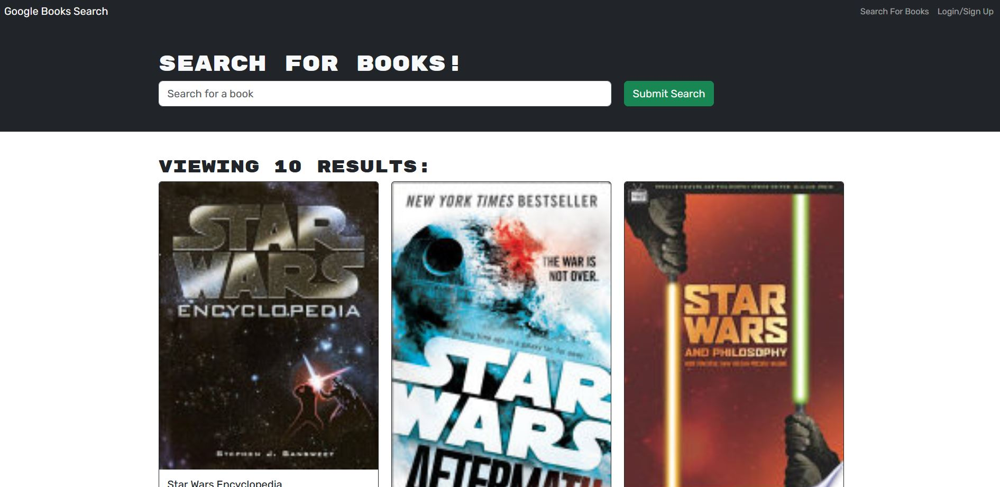

# Book-Search-Engine
Refactored RESTFUL API to work with GraphQL

## Description
Main Topic: Apollo Server, GraphQL

MERN stack for searching books using Google Books API. This app originally used RESTFUL API but the code has been refactored to use GraphQL and Apolllo server for data manipulation. Updated the auth middleware for the server so that it can work with GraphQL API.


## Screenshot



## Link
[Click here](https://murmuring-garden-96565-bc6da3db4b5c.herokuapp.com/)


## Developed by:
```
John Foxwell
```
